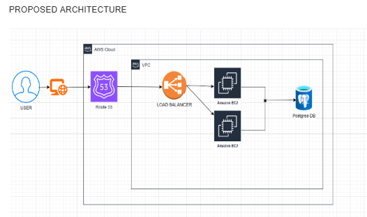
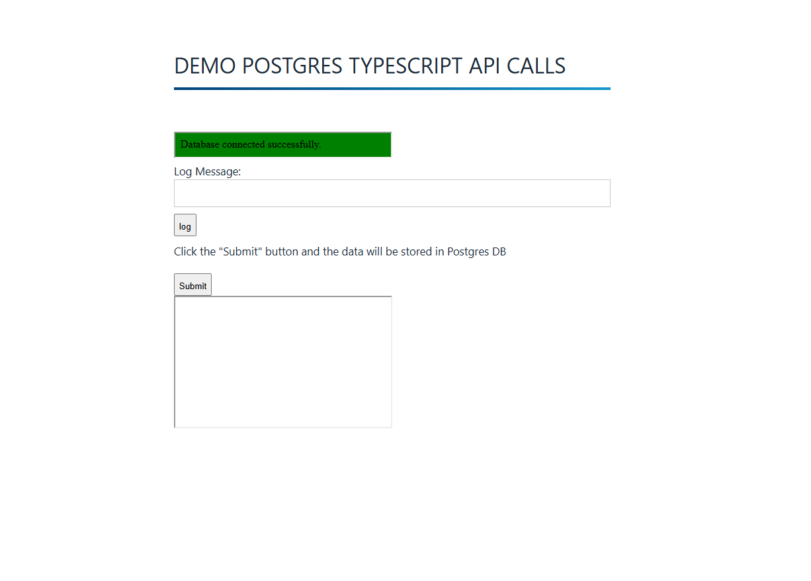

# Assignment
```
"Create a backend using TypeScript and a PostgreSQL database with one table named “log”.
The exposed backend API must enable the insertion and listing of data.
The log table must have:
an “id” column as the primary key
an “inserted_at” column of type “timestamptz” with the default value: “now()”
a “json” column of type “json”
All columns must have the “NOT NULL” constraint.
Create a CI/CD pipeline using GitHub actions to test and deploy the backend using infrastructure as code in any environment.
We expect that this assignment takes about 1-3 hrs to complete. Feel free to use any tools/environment you wish or are comfortable with to accomplish the task."
```
# PROJECT URL :(http://54.171.205.247/)

## Overview
Your task is to create a backend using **TypeScript** and a **PostgreSQL** database. The backend must expose an API that allows for inserting and listing data from a `log` table.

### Backend API
The backend should expose an API that allows:
1. **Insertion** of new log entries
2. **Listing** existing log entries

## Time Estimate
This assignment is expected to take approximately **1-3 hours**.

## Tools & Environment
Feel free to use any tools, frameworks, or environments that you are comfortable with to complete this task.

## Submission
Ensure your code is well-documented and structured. Provide instructions on how to set up and run the project in a `README.md` file.


# INFRASTRUCTURE 




I implementeed architecture successfully in AWS

Plan: 41 to add, 0 to change, 0 to destroy.

───────────────────────────────────────────────────────────────────────────────────────────────────────────────────────────────────────────────────────────────────────────────────

Note: You didn't use the -out option to save this plan, so Terraform can't guarantee to take exactly these actions if you run "terraform apply" now.


I setup Nginx server with Typescript and tried to run on port 5000

The web interface setup looks like this




I built a Docker container running the app in node.js from typescript and curl should reply to the request on port 5000

curl -H 'Content-Type: application/json' \
http://localhost:5000/api/v1/get


```sh
curl -H 'Content-Type: application/json' \
-d '{"username": "mateo", "email": "mateo@gmail.com"}' \
-X POST \
http://localhost:5000/api/v1/post
```


# DATABASE

prostgresdb=> \c log
psql (15.10 (Debian 15.10-0+deb12u1), server 14.14)
SSL connection (protocol: TLSv1.2, cipher: ECDHE-RSA-AES256-GCM-SHA384, compression: off)
You are now connected to database "log" as user "root".
log=>

```sh
log=> \dt
       List of relations
 Schema | Name | Type  | Owner
--------+------+-------+-------
 public | logs | table | root
(1 row)
```
```sh
log=> SELECT * from logs;
 id |      log       |           timestamp
----+----------------+-------------------------------
  1 | this is a test | 2025-02-11 16:50:33.657831+00
(1 row)
```

I encountered several difficulties during npm installation and troubleshoot. 
